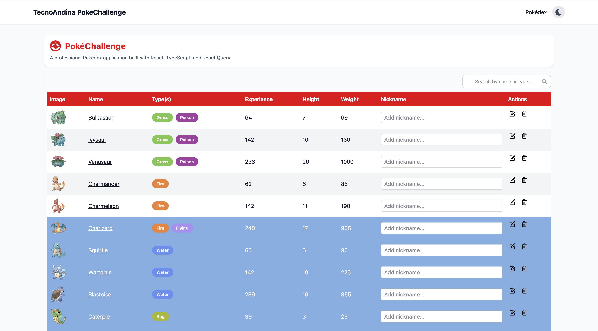
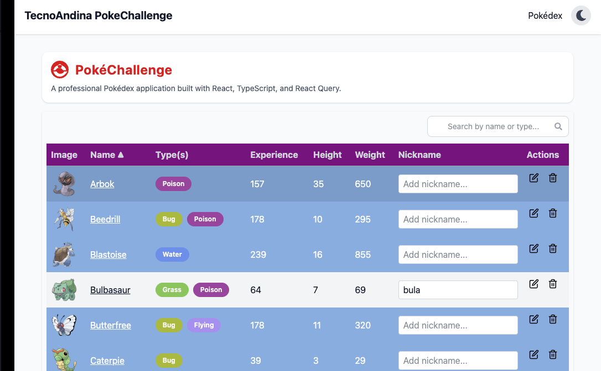
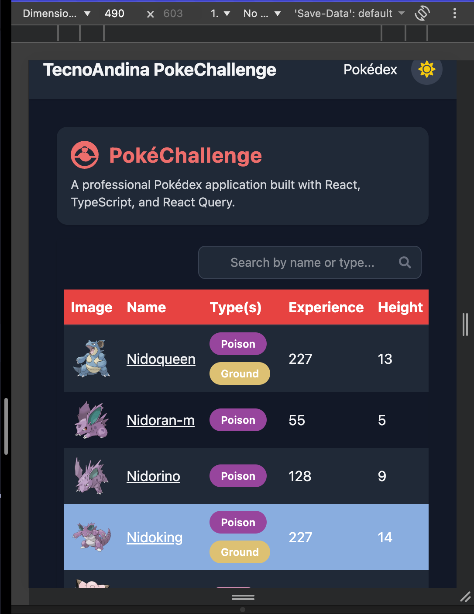
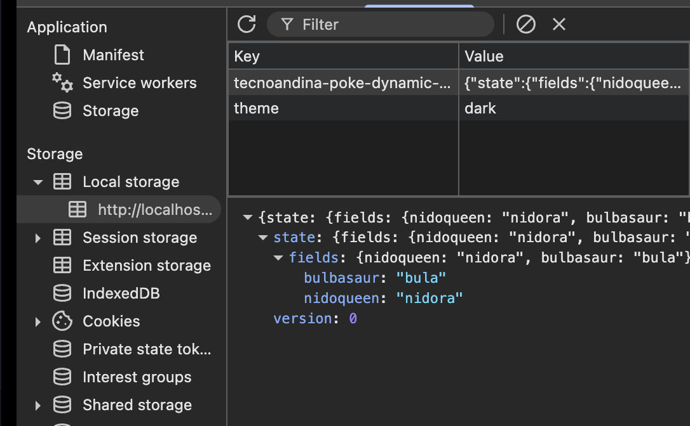
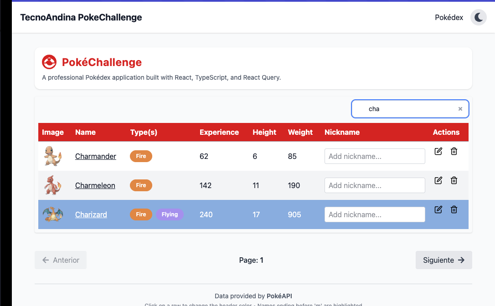
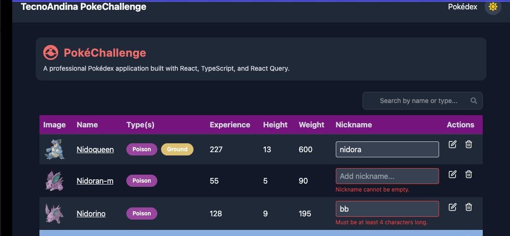
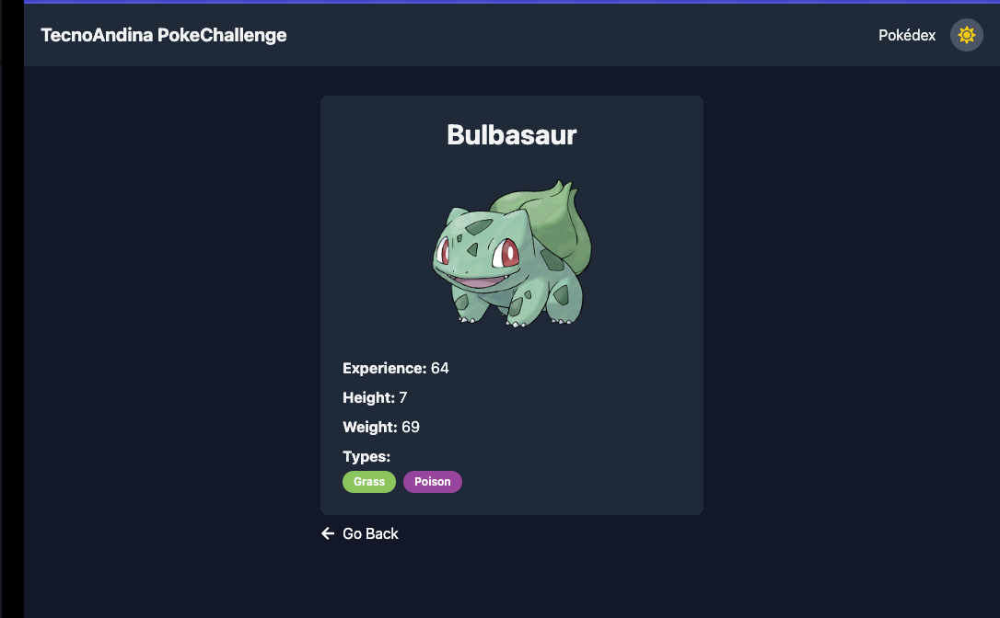

# PokéChallenge

Bienvenido al desafío frontend de **Tecnoandina**.  
Este challenge tiene como objetivo evaluar tus habilidades profesionales en arquitectura de aplicaciones, optimización, buenas prácticas y diseño de UI a través de la construcción de una **Pokédex dinámica y escalable**.

---

## Instalación y uso

1. Clonar el repositorio:

```bash
git clone https://github.com/Ronstein/tecnoandina-pokechallenge.git

cd tecnoandina-pokechallenge
```

2. Instalar dependencias:

```bash
npm install
```

3. Ejecutar la aplicación:

```bash
npm run dev
```

4. Abrir en el navegador:

```
http://localhost:5173
```

> 

---

## Tecnologías usadas

- **React** ^19.1.1
- **React DOM** ^19.1.1
- **React Router** ^7.9.4
- **React Hook Form** ^7.65.0
- **React Icons** ^5.5.0
- **Tailwind CSS** ^4.1.16
- **@tailwindcss/vite** ^4.1.16
- **React Query** ^5.90.5
- **Axios** ^1.13.0
- **Zustand** ^5.0.8
- **Vite** ^7.1.7


---

## Objetivo del challenge

Construir una Pokédex web basada en la **PokéAPI**, cumpliendo criterios de **escalabilidad, mantenibilidad, rendimiento y experiencia de usuario**.

> **Diseño Figma de referencia:** 
```
https://www.figma.com/design/2JngNT810lfSyKKmDhee6e/Untitled?node-id=1-3&t=oHSvZw8akZszPtZV-1
```
---

## Requisitos funcionales

### Datos requeridos

- Obtener los primeros 30 Pokémon desde:

```
https://pokeapi.co/api/v2/pokemon?limit=30
```

- Para cada Pokémon, se realizaron dos peticiones:
  - `/pokemon/{name}` → detalles (imagen, experiencia, altura, peso, tipos)  
  - `/pokemon-species/{name}` → color para el encabezado

---

### Tabla de visualización

| Imagen | Nombre | Tipo(s) | Experiencia | Altura | Peso | Campo Dinámico | Acciones |

**Nota: Se han dejado los nombres de la columnas y de los componentes de acuerdo a la maqueta de Figma (Ingles)**

- **Interacción**:
  - Ordenar alfabéticamente por nombre  
  - Al hacer clic en una fila, el encabezado `<thead>` cambia su color según el color del Pokémon  
  - Si el nombre termina en una letra anterior a `"m"`, pintar esa fila con `#7faee3`  
  - Acciones por fila:
    - Editar nombre  
    - Eliminar Pokémon  
    - Campo de input dinámico por fila (ej: apodo, nota, nivel, etc.)

> 

---

## Requisitos técnicos

### Arquitectura profesional

- Código organizado por **features/domains**  
- Uso de **TypeScript** con tipos estrictos  
- Componentes **desacoplados y reutilizables**


### Estado y asincronía

- Tanstack Query (React Query) para manejo de datos  
- Cancelación de peticiones soportada  
- Estado global para guardar nickname del Pókemon y tema Light o Dark (Zustand)


### Rendimiento

- Paginación para scroll de Pokémon  
- Lazy loading de imágenes y componentes  
- Memoización con `useMemo`, `React.memo`  
- Code splitting con `React.lazy` y `Suspense`


### UI/UX

- Diseño **responsive** y adaptado a móviles  
- Accesibilidad (roles ARIA y uso de teclado)  
- Animaciones suaves al eliminar filas  
- Soporte de **dark mode**

> 

### Persistencia

- Campo dinámico persistido, tema light/dark almacenado en **localStorage**

>  

---

## Extras realizados

### 🔍 **Búsqueda de Pokémon por Nombre o Tipo**

Se agregó una funcionalidad adicional que permite **filtrar Pokémon** dentro de la tabla mediante un campo de búsqueda.

- El usuario puede escribir parte del **nombre** o **tipo** del Pokémon.  
- El filtrado se realiza en tiempo real sin necesidad de recargar la página.  
- Esta característica mejora la **usabilidad** y la **experiencia de navegación**, permitiendo encontrar rápidamente un Pokémon específico.

>  

### 🧩 **Validaciones de Formularios con React Hook Form**

Se implementaron validaciones de formularios utilizando **React Hook Form** para asegurar la calidad de los datos ingresados.  
Los siguientes campos se validan de forma dinámica:

- **Nombre del Pokémon:** requerido y con un mínimo de **4 caracteres**.  
- **Nickname (apodo):** requerido y con un mínimo de **4 caracteres**.  

Si el usuario intenta guardar sin cumplir las condiciones, se muestran mensajes de error amigables en inglés, como:

> “Nickname cannot be empty.”  
> “Must be at least 4 characters long.”

>  

### 📄 **Pantalla de Detalle de Pokémon** (`PokemonDetailPage`)

Se desarrolló una pantalla adicional de detalle para cada Pokémon, la cual **no fue solicitada en los requisitos originales del desafío técnico**, pero se implementó como **mejora extra** para enriquecer la experiencia del usuario.

Esta vista muestra información detallada de cada Pokémon, incluyendo:

- Imagen oficial   
- Experiencia base  
- Altura  
- Peso  
- Tipos con su respectivo color  

>  

---

## Conversaciones generales con IA

1. Refactorización de `PokemonTableRow` en componentes (`PokemonImageCell`, `PokemonTypes`, `PokemonActions`, etc.)  
2. Cambio de color dinámico en filas y encabezados usando variables CSS y Tailwind para light/dark  
3. Validaciones de input dinámico por fila con React Hook Form y mensajes en inglés  


---

## Extras valorados no implementados

- Storybook para documentar componentes

---

## 🧑‍💻 Autor

**Rodrigo Pavez**  
Desarrollador Frontend & Mobile  
Especializado en React, Next.js, Angular, React Native, Flutter, Swift, Kotlin y .NET.

📧 Contacto: [ron.pavezb@gmail.com]
